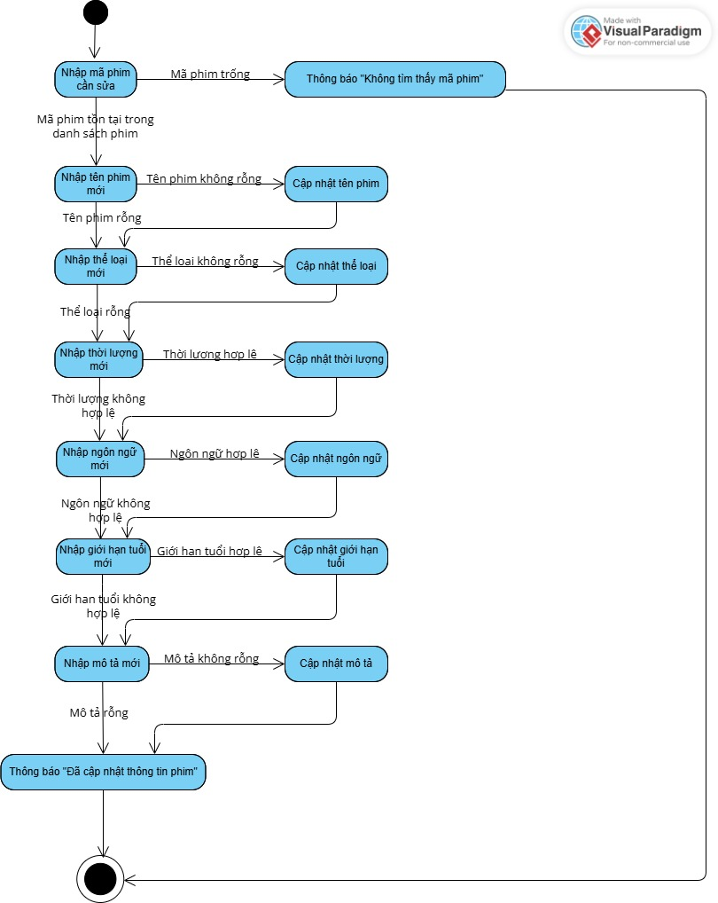

# OOP_N05_T3_2025_TRANG_SANG

ỨNG DỤNG QUẢN LÝ RẠP PHIM

# Describe and Analyse the Project

Đối tượng:
- Phim (maPhim, tenPhim, theLoai, thoiLuong, ngonNgu, gioiHanTuoi, moTa)
- KhachHang (CCCD, ten, tuoi, sdt, email, gioiTinh, lichSuDatVe)
- PhongChieu (maPhong, tenPhong, soHangGhe, soCotGhe)
- Ghe (maGhe, hang, cot, maPhong, maSuatChieu, trangThai)
- Ve (maVe, CCCD, maSuatChieu, maGhe, giaVe, trangThai)
- SuatChieu (maSuatCHieu, maPhim, maPhong, thoiGianBatDau, thoiGianKetThuc, danhSachGheTrong)
- Voucher (maVoucher, moTa, phanTramGiamGia, ngayBatDau, ngayKetThuc, soLuongConLai, trangThai)
- DanhGia (maDanhGia, CCCD, maPhim, soSao, noiDung, thoiGian)
- HoaDon (maHoaDon, doAn, tongTien, thoiGianThanhToan, phuongThucThanhToan, CCCD)

Thành viên:
1. Kiều Thị Thu Trang, MSV: 24100093 (kttt294)
2. Trần Minh Sang, MSV : 24100012 (sangzesy)
3. Nguyễn Lệ Thu (nglthu1979)

**PHIM**

**Sơ đồ chức năng**

**Sơ đồ thuật toán**

Create

Update

Read

Delete

**KHÁCH HÀNG**

**Sơ đồ chức năng**

**Sơ đồ thuật toán**

Create

Edit

Read

Delete

              PRACTICE 02 (Week 2)
Câu 1: Tiêu đề của bài tập lớn cuối kỳ: Ứng dụng uản lý rạp chiếu phim (CinemaManager)

Câu 2: 03 đối tượng cơ sở cần thiết là:
1. Phim (đối tượng quản lý thông tin Phim): Đại diện cho 1 bộ phim được chiếu tại rạp. Gồm các thuộc tính:
  + maPhim (String): mã phim
  + tenPhim (String): tên phim
  + theLoai (String): thể loại phim
  + thoiLuong (int - đơn vị: Phút): thời lượng phim
  + ngonNgu (String): ngôn ngữ của phim
  + gioiHanTuoi (int - đơn vị: tuổi): giới hạn độ tuổi xem phim
  + moTa (String): mô tả phim
2. SuatChieu (đối tượng quản lý lịch chiếu): lưu thông tin một suất chiếu cụ thể của phim. Gồm:
  + maSuatChieu (String): mã suất chiếu
  + phim (Phim): bộ phim được chiếu, có kiểu là class Phim
  + phongChieu (PhongChieu): phòng chiếu bộ phim đó, có kiểu là class PhongChieu
  + thoiGianBatDau (LocalDateTime): thời gian bắt đầu chiếu bộ phim
  + thoiGianKetThuc (LocalDateTime): thời gian kết thúc chiếu bộ phim
  + danhSachGheTrong (List<Ghe>): danh sách ghế còn trống cho suất chiếu hiện tại
3. KhachHang (đối tượng quản lý người mua vé): quản lý thông tin khách hàng mua vé. Gồm:
  + maKH (String): mã khách hàng
  + tenKH (String): tên khách hàng
  + tuoi (int): tuổi của khách hàng
  + sdt (String): số điện thoại của khách hàng
  + email (String): email của khách hàng
  + gioiTinh (GioiTinh): giới tính của khách hàng, có kiểu là class GioiTinh
  + lichSuDatVe (List<Ve>): lịch sử đặt vé của khách hàng này

Câu 3: Cấu trúc folder của project:
CinemaManager/src/controller/model/Phim.java  
CinemaManager/src/controller/model/SuatChieu.java  
CinemaManager/src/controller/model/KhachHang.java  
CinemaManager/src/controller/model/... (các model khác)  
CinemaManager/src/App.java  
CinemaManager/test/testPhim.java  
CinemaManager/test/testSuatChieu.java  
CinemaManager/test/testKhachHang.java  
CinemaManager/README.md  

Câu 4: Các class được viết cho 3 đối tượng chính đã nêu trong Câu 2 là:
Phim.java: chứa thông tin phim và kiểm tra độ tuổi hợp lệ.
SuatChieu.java: quản lý thời gian chiếu, ghế trống, liên kết phim.
KhachHang.java: quản lý thông tin khách và danh sách vé đã đặt.

Câu 5: 3 class kiểm định tương ứng với 3 class ở Câu 4, đặt trong thư mục test:
testPhim.java: nhập thông tin phim từ bàn phím, kiểm tra độ tuổi.
testSuatChieu.java: tạo suất chiếu, hiển thị ghế, cập nhật ghế sau khi đặt.
testKhachHang.java: nhập thông tin khách hàng và in ra kết quả.
